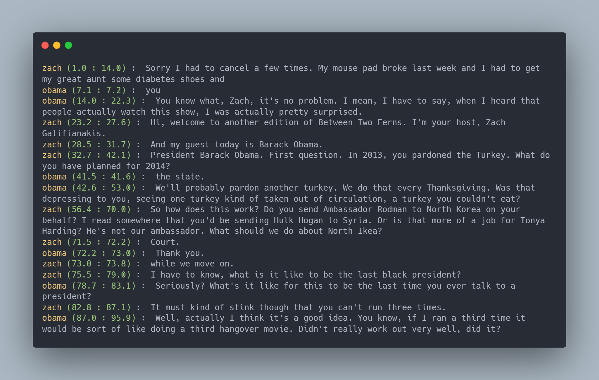

installation:
```
pip install speechlib
```

This library does speaker diarization, speaker recognition, and transcription on a single wav file to provide a transcript with actual speaker names. This library will also return an array containing result information. ⚙ 

This library contains following audio preprocessing functions:

1. convert mp3 to wav

2. convert stereo wav file to mono

3. re-encode the wav file to have 16-bit PCM encoding

Transcriptor method takes 5 arguments. 

1. file to transcribe

2. log_folder to store transcription

3. language used for transcribing

4. model size ("tiny", "medium", or "large")

5. voices_folder (contains speaker voice samples for speaker recognition)

voices_folder should contain subfolders named with speaker names. Each subfolder belongs to a speaker and it can contain many voice samples. This will be used for speaker recognition to identify the speaker.

if voices_folder is not provided then speaker tags will be arbitrary.

log_folder is to store the final transcript as a text file.

transcript will also indicate the timeframe in seconds where each speaker speaks.

### Transcription example:

```
from speechlib import Transcriptor

file = "obama1.wav"
voices_folder = "voices"
language = "english"
log_folder = "logs"
modelSize = "medium"

transcriptor = Transcriptor(file, log_folder, language, modelSize, voices_folder)

res = transcriptor.transcribe()

res --> [["start", "end", "text", "speaker"], ["start", "end", "text", "speaker"]...]
```

start: starting time of speech in seconds  
end: ending time of speech in seconds  
text: transcribed text for speech   during start and end  
speaker: speaker of the text  



supported languages:  

['english', 'chinese', 'german', 'spanish', 'russian', 'korean', 'french', 'japanese', 'portuguese', 'turkish', 'polish', 'catalan', 'dutch', 'arabic', 'swedish', 'italian', 'indonesian', 'hindi', 'finnish', 'vietnamese', 'hebrew', 'ukrainian', 'greek', 'malay', 'czech', 'romanian', 'danish', 'hungarian', 'tamil', 'norwegian', 'thai', 'urdu', 'croatian', 'bulgarian', 'lithuanian', 'latin', 'maori', 'malayalam', 'welsh', 'slovak', 'telugu', 'persian', 'latvian', 'bengali', 'serbian', 'azerbaijani', 'slovenian', 'kannada', 'estonian', 'macedonian', 'breton', 'basque', 'icelandic', 'armenian', 'nepali', 'mongolian', 'bosnian', 'kazakh', 'albanian', 'swahili', 'galician', 'marathi', 'punjabi', 'sinhala', 'khmer', 'shona', 'yoruba', 'somali', 'afrikaans', 'occitan', 'georgian', 'belarusian', 'tajik', 'sindhi', 'gujarati', 'amharic', 'yiddish', 'lao', 'uzbek', 'faroese', 'haitian creole', 'pashto', 'turkmen', 'nynorsk', 'maltese', 'sanskrit', 'luxembourgish', 'myanmar', 'tibetan', 'tagalog', 'malagasy', 'assamese', 'tatar', 'hawaiian', 'lingala', 'hausa', 'bashkir', 'javanese', 'sundanese', 'burmese', 'valencian', 'flemish', 'haitian', 'letzeburgesch', 'pushto', 'panjabi', 'moldavian', 'moldovan', 'sinhalese', 'castilian']

### Audio preprocessing example:

```
from speechlib import PreProcessor

file = "obama1.mp3"

# convert mp3 to wav
PreProcessor.mp3_to_wav(file)   

wav_file = "obama1.wav"

# convert wav file from stereo to mono
PreProcessor.convert_to_mono(wav_file)

# re-encode wav file to have 16-bit PCM encoding
PreProcessor.re_encode(wav_file)
```

This library uses following huggingface models:

#### https://huggingface.co/speechbrain/spkrec-ecapa-voxceleb
#### https://huggingface.co/Ransaka/whisper-tiny-sinhala-20k-8k-steps-v2
#### https://huggingface.co/openai/whisper-medium
#### https://huggingface.co/pyannote/speaker-diarization